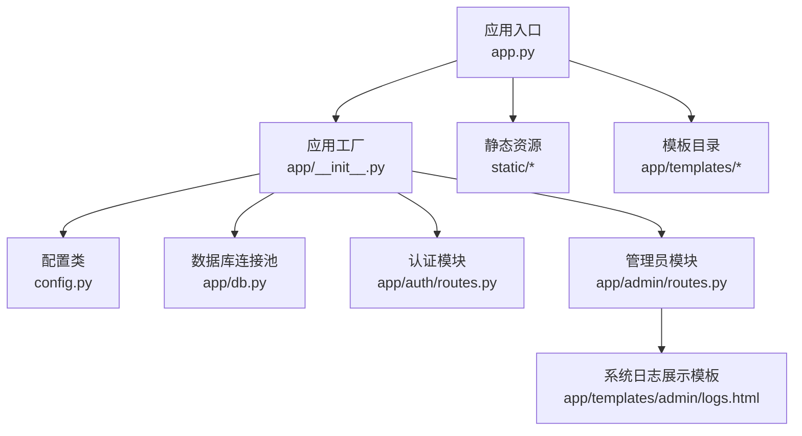
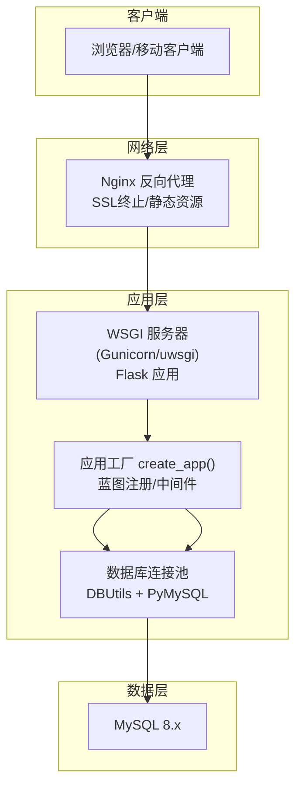
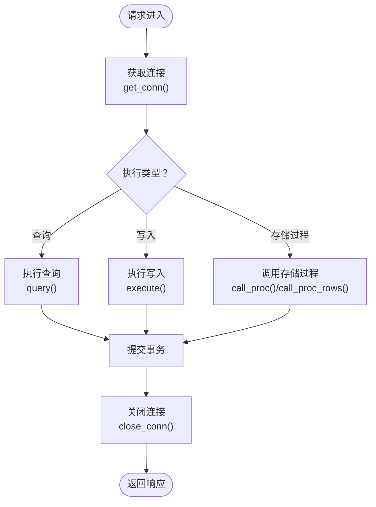
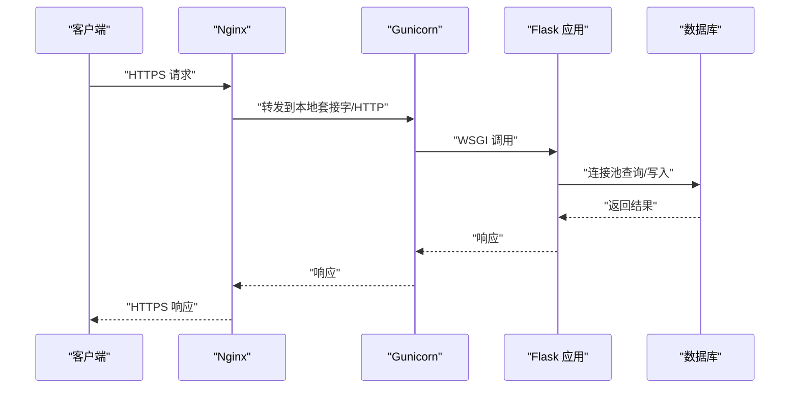
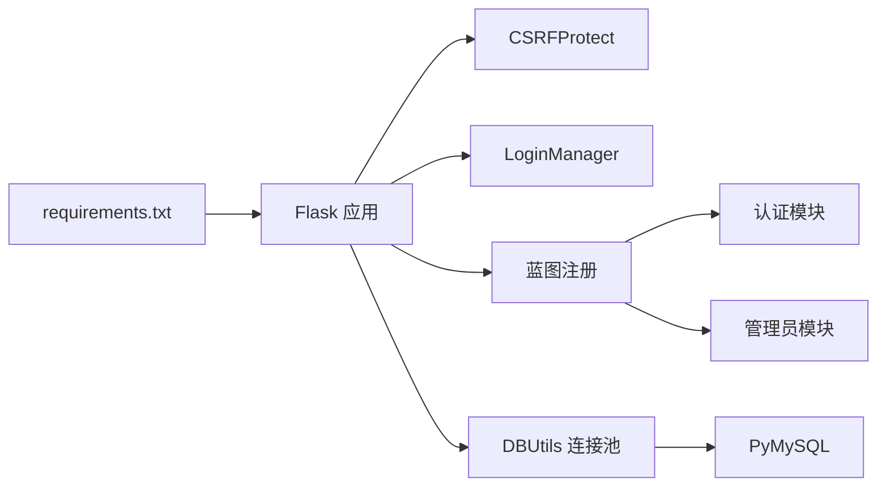

# 部署与运维

<cite>
**本文引用的文件**
- [app.py](file://app.py)
- [config.py](file://config.py)
- [requirements.txt](file://requirements.txt)
- [README.md](file://README.md)
- [app/__init__.py](file://app/__init__.py)
- [app/db.py](file://app/db.py)
- [app/admin/routes.py](file://app/admin/routes.py)
- [app/auth/routes.py](file://app/auth/routes.py)
- [app/templates/admin/logs.html](file://app/templates/admin/logs.html)
- [app/templates/500.html](file://app/templates/500.html)
- [static/js/main.js](file://static/js/main.js)
</cite>

## 目录
1. [简介](#简介)
2. [项目结构](#项目结构)
3. [核心组件](#核心组件)
4. [架构总览](#架构总览)
5. [详细组件分析](#详细组件分析)
6. [依赖关系分析](#依赖关系分析)
7. [性能考虑](#性能考虑)
8. [故障排除指南](#故障排除指南)
9. [结论](#结论)
10. [附录](#附录)

## 简介
本指南面向生产环境部署与运维学生信息管理系统（MIS），覆盖服务器环境准备、依赖安装、配置文件设置、数据库部署策略、应用服务器配置、环境变量管理、日志管理、备份恢复、性能监控、安全加固以及故障排除等内容。文档基于仓库现有代码与说明文件进行提炼与扩展，确保可操作性与可追溯性。

## 项目结构
系统采用 Flask 应用结构，核心入口负责创建应用实例并注册蓝图；数据库层使用 PyMySQL + DBUtils 连接池；模板与静态资源位于 app/templates 与 static 目录；数据库初始化脚本位于 sql 目录。

图表来源
- [app.py:1-13](file://app.py#L1-L13)
- [app/__init__.py:29-93](file://app/__init__.py#L29-L93)
- [config.py:6-36](file://config.py#L6-L36)
- [app/db.py:10-121](file://app/db.py#L10-L121)
- [app/auth/routes.py:29-167](file://app/auth/routes.py#L29-L167)
- [app/admin/routes.py:10-615](file://app/admin/routes.py#L10-L615)
- [app/templates/admin/logs.html:1-23](file://app/templates/admin/logs.html#L1-L23)

章节来源
- [README.md:46-69](file://README.md#L46-L69)
- [app.py:1-13](file://app.py#L1-L13)
- [app/__init__.py:29-93](file://app/__init__.py#L29-L93)
- [app/db.py:10-121](file://app/db.py#L10-L121)

## 核心组件
- 应用入口与运行参数
  - 入口文件通过环境变量控制主机与端口，调试模式由配置决定。
  - 参考路径：[app.py:7-12](file://app.py#L7-L12)
- 配置管理
  - 配置类集中管理密钥、数据库连接参数、连接池参数、分页参数与权重阈值。
  - 参考路径：[config.py:6-36](file://config.py#L6-L36)
- 数据库连接池与查询工具
  - 使用 DBUtils 的 PooledDB 创建连接池，封装查询、执行、存储过程调用与分页逻辑。
  - 参考路径：[app/db.py:10-121](file://app/db.py#L10-L121)
- 蓝图与路由
  - 认证与管理员模块注册到应用，提供登录、注册、个人信息、系统日志等页面与接口。
  - 参考路径：[app/__init__.py:54-64](file://app/__init__.py#L54-L64)、[app/auth/routes.py:29-167](file://app/auth/routes.py#L29-L167)、[app/admin/routes.py:10-615](file://app/admin/routes.py#L10-L615)
- 错误处理与模板
  - 注册 403/404/500 错误页面，便于统一展示与记录。
  - 参考路径：[app/__init__.py:76-91](file://app/__init__.py#L76-L91)、[app/templates/500.html:1-11](file://app/templates/500.html#L1-L11)

章节来源
- [app.py:7-12](file://app.py#L7-L12)
- [config.py:6-36](file://config.py#L6-L36)
- [app/db.py:10-121](file://app/db.py#L10-L121)
- [app/__init__.py:54-64](file://app/__init__.py#L54-L64)
- [app/auth/routes.py:29-167](file://app/auth/routes.py#L29-L167)
- [app/admin/routes.py:10-615](file://app/admin/routes.py#L10-L615)
- [app/templates/500.html:1-11](file://app/templates/500.html#L1-L11)

## 架构总览
系统采用“Web 服务器 + 应用服务器 + 数据库”的三层架构。生产环境建议使用 WSGI 服务器承载 Flask 应用，Nginx 作为反向代理与静态资源服务，MySQL 提供持久化存储。

图表来源
- [app.py:1-13](file://app.py#L1-L13)
- [app/__init__.py:29-93](file://app/__init__.py#L29-L93)
- [app/db.py:10-121](file://app/db.py#L10-L121)

## 详细组件分析

### 数据库部署策略
- 连接参数与连接池
  - 通过配置类读取数据库主机、端口、账号、密码、库名与字符集。
  - 连接池最小缓存、最大缓存与最大连接数在配置中定义。
  - 参考路径：[config.py:11-22](file://config.py#L11-L22)、[app/db.py:13-26](file://app/db.py#L13-L26)
- 初始化与事务
  - 应用启动时初始化连接池，并在请求结束时关闭连接。
  - 所有写操作需显式提交，查询返回字典列表，支持存储过程调用与 OUT 参数读取。
  - 参考路径：[app/__init__.py:35-38](file://app/__init__.py#L35-L38)、[app/db.py:43-80](file://app/db.py#L43-L80)
- 分页与统计
  - 提供通用分页函数，支持自定义计数 SQL 或自动包装计数。
  - 管理员模块使用视图与存储过程进行统计分析与预警。
  - 参考路径：[app/db.py:92-121](file://app/db.py#L92-L121)、[app/admin/routes.py:547-574](file://app/admin/routes.py#L547-L574)

图表来源
- [app/db.py:29-80](file://app/db.py#L29-L80)
- [app/db.py:92-121](file://app/db.py#L92-L121)

章节来源
- [config.py:11-22](file://config.py#L11-L22)
- [app/db.py:13-26](file://app/db.py#L13-L26)
- [app/__init__.py:35-38](file://app/__init__.py#L35-L38)
- [app/db.py:43-80](file://app/db.py#L43-L80)
- [app/db.py:92-121](file://app/db.py#L92-L121)
- [app/admin/routes.py:547-574](file://app/admin/routes.py#L547-L574)

### 应用服务器配置（Gunicorn + Nginx）
- Gunicorn
  - 使用 WSGI 应用入口 app.app，设置工作进程与线程数以适配 CPU 核心数与并发需求。
  - 参考路径：[app.py:5](file://app.py#L5)
- Nginx
  - 反向代理至 Gunicorn，启用 HTTPS（SSL 证书与密钥需自行准备），开启 gzip 压缩与静态资源缓存。
  - 参考路径：[app.py:10-12](file://app.py#L10-L12)

图表来源
- [app.py:5-12](file://app.py#L5-L12)
- [app/__init__.py:29-93](file://app/__init__.py#L29-L93)
- [app/db.py:10-121](file://app/db.py#L10-L121)

章节来源
- [app.py:5-12](file://app.py#L5-L12)
- [app/__init__.py:29-93](file://app/__init__.py#L29-L93)
- [app/db.py:10-121](file://app/db.py#L10-L121)

### 环境变量管理
- 关键环境变量
  - FLASK_HOST、FLASK_PORT、FLASK_DEBUG 控制运行参数与调试模式。
  - SECRET_KEY 用于会话签名与 CSRF。
  - DB_HOST、DB_PORT、DB_USER、DB_PASSWORD、DB_NAME 用于数据库连接。
- 建议实践
  - 生产环境务必设置 SECRET_KEY 与数据库凭据，避免硬编码。
  - 将敏感信息置于独立的 .env 文件并通过环境加载器注入。
  - 区分 dev/stage/prod 多环境，使用不同配置文件或前缀命名。
- 参考路径
  - [app.py:9-11](file://app.py#L9-L11)
  - [config.py:7](file://config.py#L7)
  - [config.py:12-16](file://config.py#L12-L16)
  - [README.md:29-30](file://README.md#L29-L30)

章节来源
- [app.py:9-11](file://app.py#L9-L11)
- [config.py:7](file://config.py#L7)
- [config.py:12-16](file://config.py#L12-L16)
- [README.md:29-30](file://README.md#L29-L30)

### 日志管理策略
- 访问日志与错误日志
  - Nginx 记录访问与错误日志，便于排查请求链路与异常。
  - 应用层错误页面模板统一展示 403/404/500。
  - 参考路径：[app/templates/500.html:1-11](file://app/templates/500.html#L1-L11)
- 业务日志
  - 管理员模块提供系统日志查看页面，支持按操作类型筛选与分页。
  - 参考路径：[app/admin/routes.py:529-543](file://app/admin/routes.py#L529-L543)、[app/templates/admin/logs.html:1-23](file://app/templates/admin/logs.html#L1-L23)
- 前端提示
  - 页面消息自动关闭，提升用户体验。
  - 参考路径：[static/js/main.js:1-10](file://static/js/main.js#L1-L10)

章节来源
- [app/templates/500.html:1-11](file://app/templates/500.html#L1-L11)
- [app/admin/routes.py:529-543](file://app/admin/routes.py#L529-L543)
- [app/templates/admin/logs.html:1-23](file://app/templates/admin/logs.html#L1-L23)
- [static/js/main.js:1-10](file://static/js/main.js#L1-L10)

### 备份与恢复方案
- 数据库备份
  - 使用 MySQL 官方工具定期导出结构与数据，结合压缩与归档策略。
  - 参考路径：[README.md:20-27](file://README.md#L20-L27)
- 文件备份
  - 静态资源与上传文件纳入统一备份范围，确保版本一致。
- 灾难恢复
  - 制定恢复演练计划，验证备份完整性与恢复时间目标（RTO/RPO）。
  - 参考路径：[README.md:20-27](file://README.md#L20-L27)

章节来源
- [README.md:20-27](file://README.md#L20-L27)

### 性能监控方法
- 应用性能
  - 使用 WSGI 服务器指标与应用内计时埋点，关注慢查询与高延迟端点。
- 数据库性能
  - 结合慢查询日志、连接池利用率与锁等待，定位瓶颈。
- 系统资源
  - 监控 CPU、内存、磁盘 IO 与网络带宽，结合 Nginx 指标分析峰值流量。
- 参考路径
  - [app/db.py:13-26](file://app/db.py#L13-L26)（连接池参数）

章节来源
- [app/db.py:13-26](file://app/db.py#L13-L26)

### 安全加固措施
- 防火墙与访问控制
  - 仅开放必要端口（如 80/443），限制源地址白名单。
- 传输安全
  - 强制 HTTPS，配置强密码套件与 HSTS。
- 应用安全
  - CSRF 保护已启用；生产环境必须设置高强度 SECRET_KEY。
  - 参考路径：[app/__init__.py:33](file://app/__init__.py#L33)、[config.py:7](file://config.py#L7)
- 审计与日志
  - 启用系统日志与数据库审计，保留合规期内的操作轨迹。
  - 参考路径：[app/admin/routes.py:529-543](file://app/admin/routes.py#L529-L543)

章节来源
- [app/__init__.py:33](file://app/__init__.py#L33)
- [config.py:7](file://config.py#L7)
- [app/admin/routes.py:529-543](file://app/admin/routes.py#L529-L543)

### 故障排除指南
- 启动失败
  - 检查环境变量是否正确注入，确认数据库连通性与凭据。
  - 参考路径：[app.py:9-11](file://app.py#L9-L11)、[config.py:12-16](file://config.py#L12-L16)
- 数据库相关错误
  - 查看连接池参数是否合理，是否存在长时间未释放的连接。
  - 参考路径：[app/db.py:13-26](file://app/db.py#L13-L26)
- 权限与认证问题
  - 确认用户状态与角色权限，检查登录视图与会话配置。
  - 参考路径：[app/auth/routes.py:32-55](file://app/auth/routes.py#L32-L55)
- 错误页面
  - 500 错误页面用于统一展示，结合 Nginx 与应用日志定位根因。
  - 参考路径：[app/templates/500.html:1-11](file://app/templates/500.html#L1-L11)

章节来源
- [app.py:9-11](file://app.py#L9-L11)
- [config.py:12-16](file://config.py#L12-L16)
- [app/db.py:13-26](file://app/db.py#L13-L26)
- [app/auth/routes.py:32-55](file://app/auth/routes.py#L32-L55)
- [app/templates/500.html:1-11](file://app/templates/500.html#L1-L11)

## 依赖关系分析
- 组件耦合
  - 应用工厂集中初始化 CSRF、登录管理、连接池与蓝图注册，降低模块间耦合。
  - 数据库层通过连接池抽象屏蔽底层细节，路由层仅依赖查询工具。
- 外部依赖
  - Flask、PyMySQL、DBUtils、Werkzeug、WTForms 等，详见 requirements。
- 参考路径
  - [requirements.txt:1-8](file://requirements.txt#L1-L8)
  - [app/__init__.py:35-64](file://app/__init__.py#L35-L64)
  - [app/db.py:13-26](file://app/db.py#L13-L26)

图表来源
- [requirements.txt:1-8](file://requirements.txt#L1-L8)
- [app/__init__.py:33-64](file://app/__init__.py#L33-L64)
- [app/db.py:13-26](file://app/db.py#L13-L26)

章节来源
- [requirements.txt:1-8](file://requirements.txt#L1-L8)
- [app/__init__.py:33-64](file://app/__init__.py#L33-L64)
- [app/db.py:13-26](file://app/db.py#L13-L26)

## 性能考虑
- 连接池调优
  - 根据并发与 QPS 调整最小缓存、最大缓存与最大连接数，避免连接不足或过度占用。
  - 参考路径：[config.py:20-22](file://config.py#L20-L22)、[app/db.py:13-26](file://app/db.py#L13-L26)
- 查询优化
  - 对高频查询建立索引，避免 N+1 查询，使用分页与条件过滤。
  - 参考路径：[app/admin/routes.py:202-216](file://app/admin/routes.py#L202-L216)、[app/db.py:92-121](file://app/db.py#L92-L121)
- 缓存与静态资源
  - Nginx 缓存静态资源，减少应用压力；对热点数据可引入应用层缓存。
- 参考路径
  - [app.py:10-12](file://app.py#L10-L12)

章节来源
- [config.py:20-22](file://config.py#L20-L22)
- [app/db.py:13-26](file://app/db.py#L13-L26)
- [app/admin/routes.py:202-216](file://app/admin/routes.py#L202-L216)
- [app/db.py:92-121](file://app/db.py#L92-L121)
- [app.py:10-12](file://app.py#L10-L12)

## 故障排除指南
- 常见问题
  - 数据库无法连接：核对主机、端口、账号与网络策略。
  - CSRF 校验失败：确认表单携带 CSRF 字段且会话有效。
  - 权限拒绝：检查用户状态与角色，确认登录视图正常。
- 参考路径
  - [app/auth/routes.py:32-55](file://app/auth/routes.py#L32-L55)
  - [app/__init__.py:76-91](file://app/__init__.py#L76-L91)

章节来源
- [app/auth/routes.py:32-55](file://app/auth/routes.py#L32-L55)
- [app/__init__.py:76-91](file://app/__init__.py#L76-L91)

## 结论
本指南从部署到运维全链路梳理了 MIS 系统的关键环节，强调了环境变量隔离、数据库连接池优化、反向代理与 SSL 配置、日志与审计、备份恢复、性能监控与安全加固。建议在生产环境中严格遵循配置分离与最小权限原则，持续监控与演练，确保系统稳定与安全。

## 附录
- 快速启动与数据库初始化
  - 参考路径：[README.md:12-36](file://README.md#L12-L36)
- 项目结构概览
  - 参考路径：[README.md:46-69](file://README.md#L46-L69)