# 项目概述

<cite>
**本文档引用的文件**
- [README.md](file://README.md)
- [app.py](file://app.py)
- [config.py](file://config.py)
- [requirements.txt](file://requirements.txt)
- [app/__init__.py](file://app/__init__.py)
- [app/db.py](file://app/db.py)
- [app/decorators.py](file://app/decorators.py)
- [app/auth/routes.py](file://app/auth/routes.py)
- [app/admin/routes.py](file://app/admin/routes.py)
- [app/student/routes.py](file://app/student/routes.py)
- [app/teacher/routes.py](file://app/teacher/routes.py)
- [sql/01_schema.sql](file://sql/01_schema.sql)
- [sql/03_procedures.sql](file://sql/03_procedures.sql)
- [sql/04_views.sql](file://sql/04_views.sql)
</cite>

## 目录
1. [简介](#简介)
2. [项目结构](#项目结构)
3. [核心组件](#核心组件)
4. [架构概览](#架构概览)
5. [详细组件分析](#详细组件分析)
6. [依赖关系分析](#依赖关系分析)
7. [性能考虑](#性能考虑)
8. [故障排除指南](#故障排除指南)
9. [结论](#结论)
10. [附录](#附录)

## 简介

校园教务选课与成绩管理系统是一个基于Flask框架开发的综合性教务管理平台，专为高校教务管理工作而设计。该系统实现了完整的教务业务流程，包括课程管理、选课退课、成绩管理、教师教学管理和学生学习跟踪等功能。

### 系统核心目标

- **提升教务管理效率**：通过数字化手段简化传统的手工教务管理工作流程
- **保障数据准确性**：利用数据库约束和存储过程确保数据的一致性和完整性
- **支持多角色协作**：为管理员、教师、学生提供差异化功能权限
- **实时数据处理**：通过触发器和存储过程实现实时的数据计算和状态同步

### 主要功能特性

- **完整的教务业务流程**：从基础信息维护到成绩发布的全生命周期管理
- **智能选课机制**：支持选课窗口控制、时间冲突检测、容量限制等
- **自动化成绩计算**：基于权重规则的自动成绩计算和GPA转换
- **多维度统计分析**：提供选课统计、成绩分布、教师工作量等多维分析
- **安全权限控制**：基于角色的细粒度权限管理和CSRF防护

## 项目结构

系统采用标准的Flask MVC架构，按照功能模块进行组织，具有清晰的层次结构和职责分离。

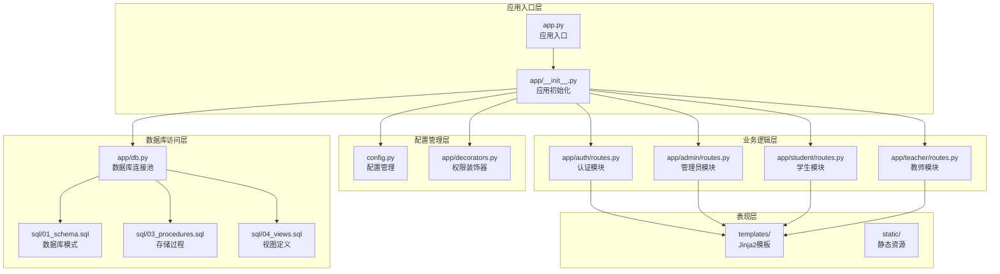

**图表来源**
- [app.py:1-13](file://app.py#L1-L13)
- [app/__init__.py:29-93](file://app/__init__.py#L29-L93)
- [config.py:6-30](file://config.py#L6-L30)

**章节来源**
- [README.md:45-67](file://README.md#L45-L67)
- [app/__init__.py:29-93](file://app/__init__.py#L29-L93)

## 核心组件

### 技术栈架构

系统采用现代Web开发技术栈，确保了良好的可维护性和扩展性：

- **后端框架**：Flask 3.x，轻量级但功能强大的Python Web框架
- **数据库**：MySQL 8.x，支持存储过程、触发器和视图的完整数据库解决方案
- **前端技术**：Bootstrap 5 + Jinja2 + Chart.js，提供现代化的用户界面
- **数据库驱动**：PyMySQL + DBUtils连接池，优化数据库连接性能

### 数据库设计

系统采用12张核心表的完整关系模型设计，遵循第三范式(3NF)，确保数据冗余最小化和一致性。

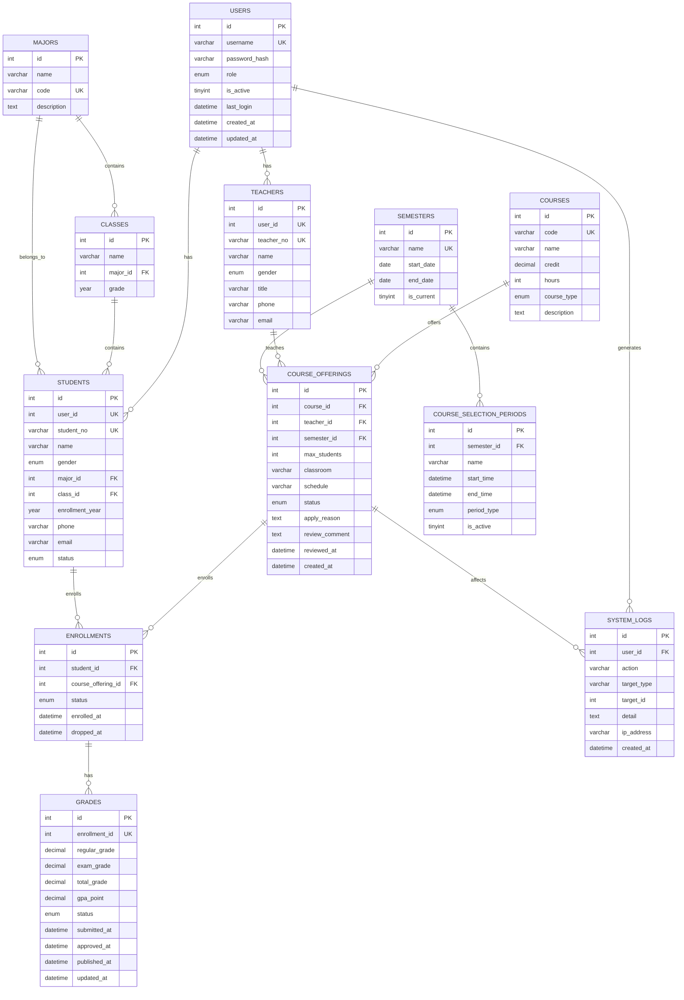

**图表来源**
- [sql/01_schema.sql:15-235](file://sql/01_schema.sql#L15-L235)

### 存储过程与触发器

系统集成了5个核心存储过程和3个触发器，实现了复杂的业务逻辑自动化：

- **选课存储过程**：sp_enroll_course - 处理选课业务逻辑，包含窗口检查、冲突检测、容量控制
- **退课存储过程**：sp_drop_course - 处理退课业务逻辑，包含窗口检查、成绩状态验证
- **成绩计算存储过程**：sp_calculate_total_grade - 基于权重规则的自动计算
- **GPA计算存储过程**：sp_calculate_gpa - 学期GPA的综合计算
- **开课审核存储过程**：sp_approve_course_offering - 开课申请的审核流程

**章节来源**
- [README.md:69-75](file://README.md#L69-L75)
- [sql/03_procedures.sql:14-381](file://sql/03_procedures.sql#L14-L381)

## 架构概览

系统采用经典的MVC架构模式，结合Flask的蓝图(Blueprint)机制实现模块化设计。

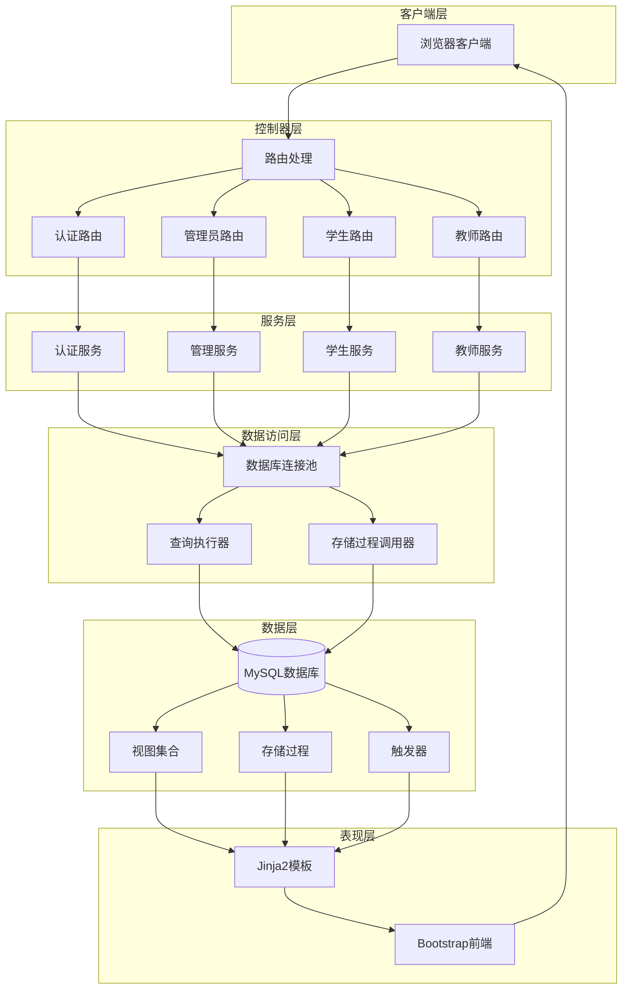

**图表来源**
- [app/__init__.py:29-93](file://app/__init__.py#L29-L93)
- [app/db.py:10-111](file://app/db.py#L10-L111)

### 角色权限体系

系统实现了基于角色的访问控制(RBAC)，为不同用户角色提供相应的功能权限：

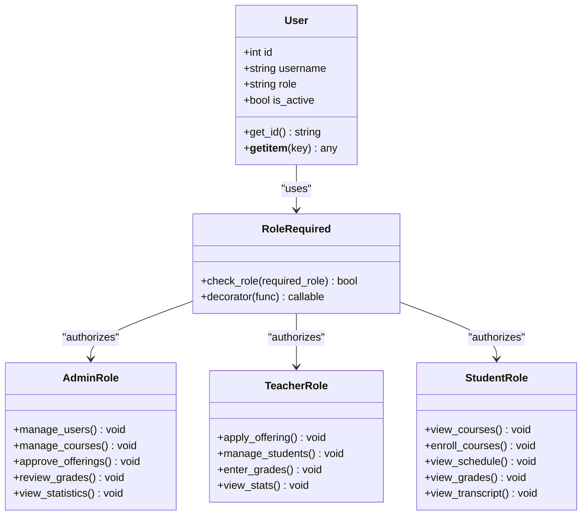

**图表来源**
- [app/decorators.py:13-26](file://app/decorators.py#L13-L26)
- [app/auth/routes.py:32-56](file://app/auth/routes.py#L32-L56)

**章节来源**
- [app/decorators.py:13-26](file://app/decorators.py#L13-L26)
- [app/auth/routes.py:32-56](file://app/auth/routes.py#L32-L56)

## 详细组件分析

### 认证与授权模块

认证模块负责用户身份验证、会话管理和权限控制，是整个系统安全的基础。

#### 登录流程分析

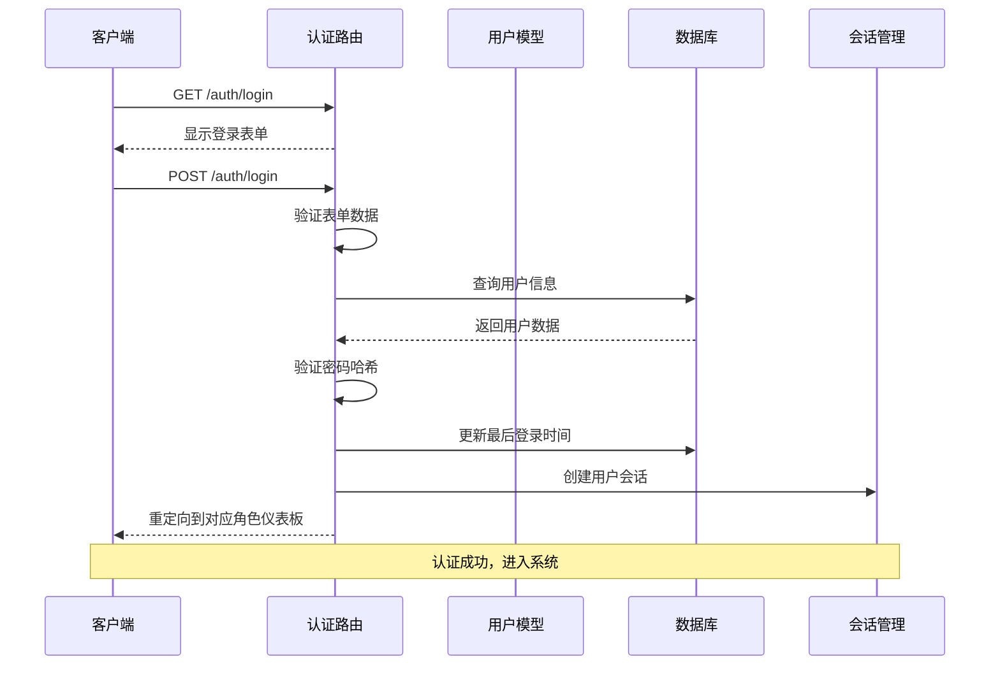

**图表来源**
- [app/auth/routes.py:32-56](file://app/auth/routes.py#L32-L56)
- [app/__init__.py:47-51](file://app/__init__.py#L47-L51)

#### 注册流程分析

注册模块支持学生和教师两种类型的用户注册，自动分配唯一标识符并创建相应的个人信息记录。

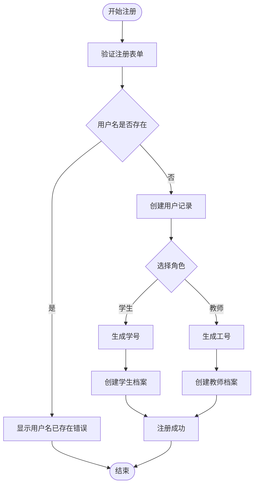

**图表来源**
- [app/auth/routes.py:58-111](file://app/auth/routes.py#L58-L111)

**章节来源**
- [app/auth/routes.py:32-111](file://app/auth/routes.py#L32-L111)

### 管理员模块

管理员模块是系统的核心管理功能，负责整个教务系统的日常运营维护。

#### 业务流程分析

管理员的工作流程涵盖了从基础数据维护到最终成绩发布的完整生命周期：

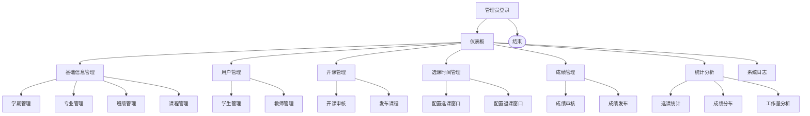

**图表来源**
- [app/admin/routes.py:17-423](file://app/admin/routes.py#L17-L423)

#### 开课审核流程

管理员对教师提交的开课申请进行审核，确保教学资源的合理配置。

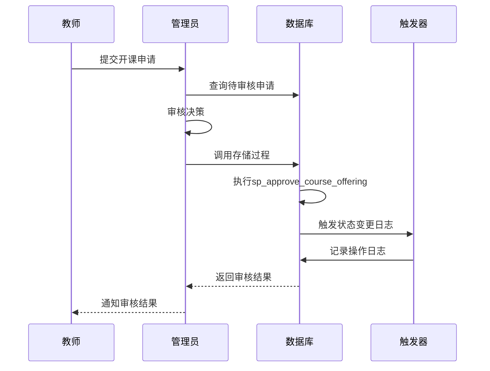

**图表来源**
- [app/admin/routes.py:264-282](file://app/admin/routes.py#L264-L282)
- [sql/03_procedures.sql:277-320](file://sql/03_procedures.sql#L277-L320)

**章节来源**
- [app/admin/routes.py:17-423](file://app/admin/routes.py#L17-L423)

### 学生模块

学生模块提供了完整的选课、学习跟踪和成绩查询功能。

#### 选课退课流程

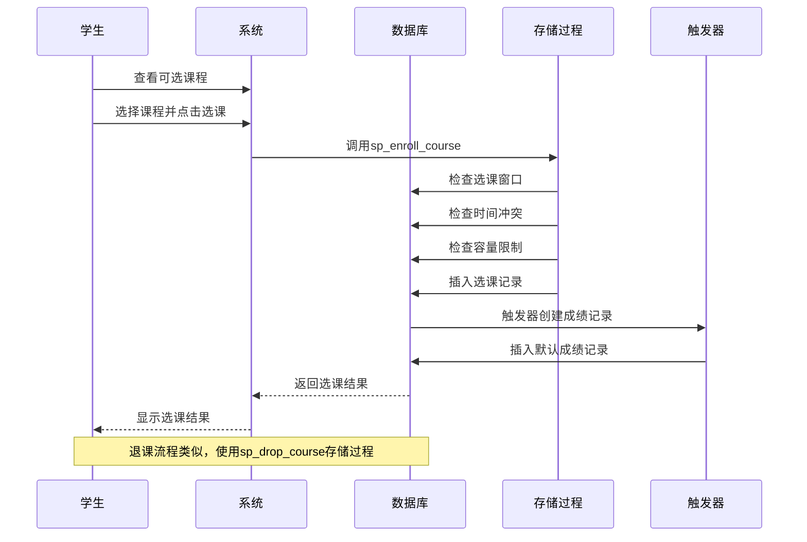

**图表来源**
- [app/student/routes.py:118-144](file://app/student/routes.py#L118-L144)
- [sql/03_procedures.sql:14-114](file://sql/03_procedures.sql#L14-L114)

#### 成绩查询与统计

学生可以查看个人的完整学习记录和GPA统计信息。

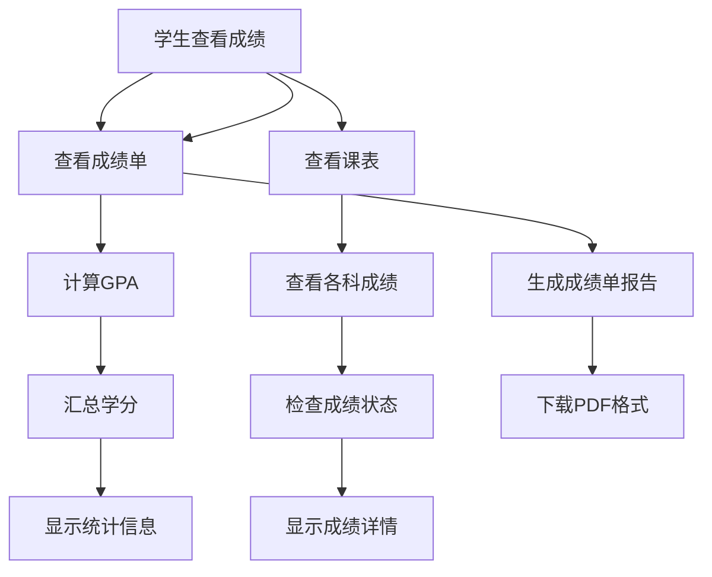

**图表来源**
- [app/student/routes.py:155-203](file://app/student/routes.py#L155-L203)

**章节来源**
- [app/student/routes.py:17-203](file://app/student/routes.py#L17-L203)

### 教师模块

教师模块专注于教学活动的管理，包括开课申请、学生管理、成绩录入等核心功能。

#### 教学管理流程

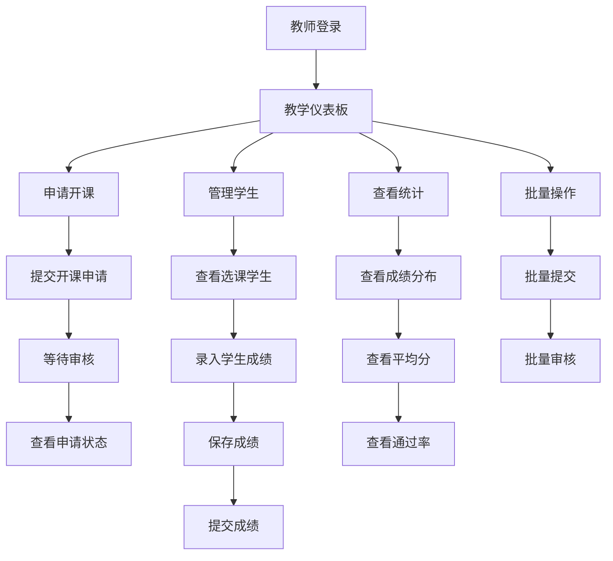

**图表来源**
- [app/teacher/routes.py:50-241](file://app/teacher/routes.py#L50-L241)

#### 成绩管理流程

教师可以为所教授课程的学生录入和管理成绩信息。

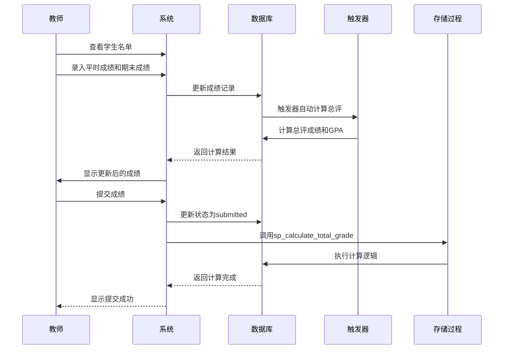

**图表来源**
- [app/teacher/routes.py:128-182](file://app/teacher/routes.py#L128-L182)
- [sql/03_procedures.sql:197-236](file://sql/03_procedures.sql#L197-L236)

**章节来源**
- [app/teacher/routes.py:17-241](file://app/teacher/routes.py#L17-L241)

## 依赖关系分析

系统采用模块化的依赖设计，确保各组件之间的松耦合和高内聚。

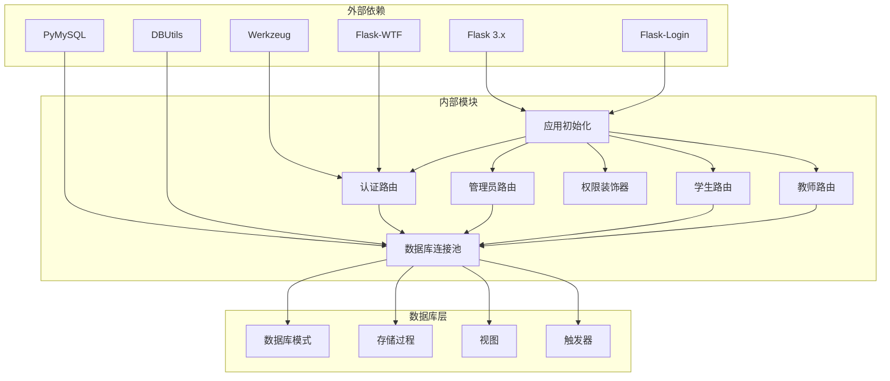

**图表来源**
- [requirements.txt:1-8](file://requirements.txt#L1-L8)
- [app/__init__.py:29-93](file://app/__init__.py#L29-L93)
- [app/db.py:10-111](file://app/db.py#L10-L111)

### 数据流分析

系统中的数据流体现了完整的业务逻辑处理链路：

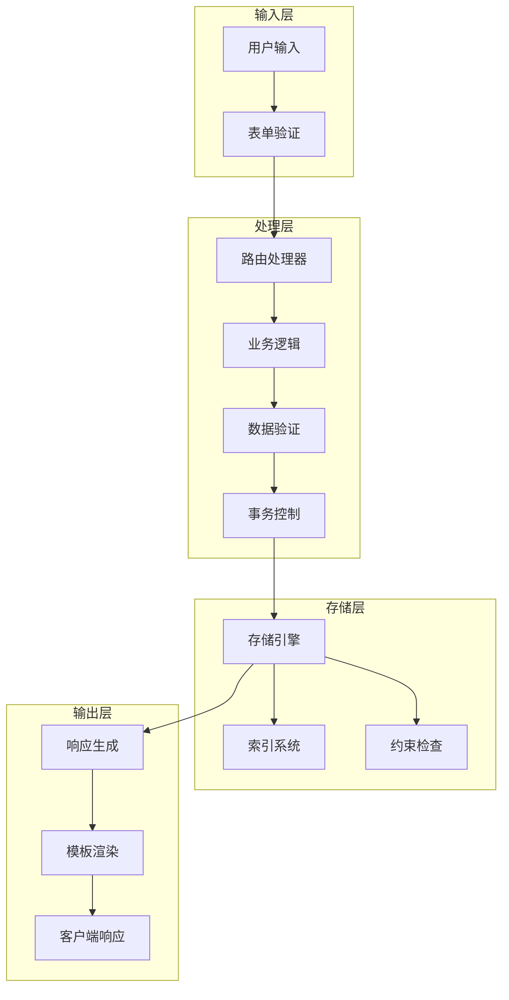

**图表来源**
- [app/db.py:43-111](file://app/db.py#L43-L111)
- [app/admin/routes.py:264-282](file://app/admin/routes.py#L264-L282)

**章节来源**
- [requirements.txt:1-8](file://requirements.txt#L1-L8)
- [app/db.py:43-111](file://app/db.py#L43-L111)

## 性能考虑

系统在设计时充分考虑了性能优化，采用了多种技术和策略来确保系统的高效运行。

### 数据库性能优化

- **连接池管理**：使用DBUtils实现数据库连接池，支持最小缓存2个、最大缓存10个、最大连接20个的配置
- **索引优化**：为常用查询字段建立适当的索引，如角色索引、学期当前状态索引、选课状态索引等
- **查询优化**：实现分页查询功能，支持大数据量的高效检索
- **事务控制**：使用存储过程和触发器确保数据一致性和原子性操作

### 缓存策略

- **连接复用**：通过连接池减少数据库连接的创建和销毁开销
- **查询结果缓存**：对于频繁访问的静态数据，如学期信息、课程类型等，采用适当的缓存策略
- **会话管理**：使用Flask-Login的会话管理机制，避免重复的身份验证开销

### 前端性能优化

- **静态资源优化**：使用Bootstrap 5提供响应式设计，支持移动端访问
- **模板继承**：通过Jinja2模板继承减少重复代码，提高渲染效率
- **异步处理**：部分操作支持异步处理，提升用户体验

## 故障排除指南

### 常见问题诊断

#### 数据库连接问题

**症状**：应用启动时报数据库连接错误
**可能原因**：
- 数据库服务器未启动
- 连接参数配置错误
- 用户权限不足
- 网络连接问题

**解决步骤**：
1. 检查数据库服务状态
2. 验证config.py中的连接参数
3. 确认数据库用户权限设置
4. 测试网络连通性

#### 权限访问问题

**症状**：用户访问受限页面时出现403错误
**可能原因**：
- 用户角色不匹配
- 会话过期
- 权限装饰器配置错误

**解决步骤**：
1. 检查用户角色设置
2. 验证权限装饰器使用
3. 清除浏览器缓存重新登录

#### 业务逻辑异常

**症状**：选课或退课操作失败
**可能原因**：
- 选课窗口未开放
- 时间冲突检测失败
- 容量限制检查异常
- 数据库事务回滚

**解决步骤**：
1. 检查选课时间段配置
2. 验证课程时间安排
3. 确认容量设置
4. 查看系统日志

**章节来源**
- [app/__init__.py:77-91](file://app/__init__.py#L77-L91)
- [app/admin/routes.py:264-282](file://app/admin/routes.py#L264-L282)

## 结论

校园教务选课与成绩管理系统是一个设计完善、功能完备的教务管理解决方案。系统采用现代化的技术架构，实现了业务逻辑的自动化和数据处理的智能化。

### 系统优势

- **完整的业务覆盖**：涵盖教务管理的各个环节，形成完整的业务闭环
- **智能的数据处理**：通过存储过程和触发器实现复杂业务逻辑的自动化
- **灵活的角色权限**：基于角色的权限控制确保系统安全性
- **良好的扩展性**：模块化的架构设计便于功能扩展和维护
- **高效的性能表现**：连接池、索引优化等技术确保系统高性能运行

### 适用场景

该系统特别适用于以下场景：
- 高等院校的日常教务管理
- 需要严格权限控制的教育机构
- 对数据一致性要求较高的教务系统
- 需要实时数据分析和统计的学校管理部门

### 发展建议

为进一步提升系统的价值，建议考虑：
- 集成移动应用支持
- 增强数据分析和报表功能
- 扩展与其他教育系统的集成能力
- 加强数据安全和备份机制